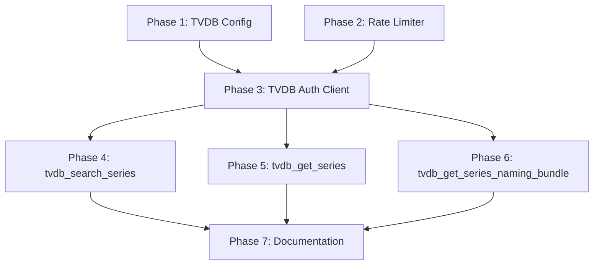

# work plan

## Instructions for the agent

- Complete **one phase at a time**. Do not begin the next phase until the current phase is fully complete.
- A phase is complete **only when all unit tests pass and all code quality checks pass**.
- After finishing each phase, report which phase is done and await instruction before starting the next.

## Code quality checks (run after every phase)

```bash
uv run ruff format
uv run ruff check
uv run mypy src/
uv run pytest tests/unit/
```

All four commands must exit with code 0 before a phase is considered done.

---

## Phase dependency diagram



---

## Phase 1 — TVDB Configuration

**Status**: incomplete

### Goal

Extend the existing configuration system to read TVDB API credentials from the `[tvdb]` section of `config.toml`.

### Tasks

1. Add a `TvdbConfig` dataclass to `src/thetvdb_mcp_server/config.py` with:
   - `api_key: str` — required
   - `pin: str | None` — optional, defaults to `None`
2. Add a `tvdb: TvdbConfig` field to `AppConfig`.
3. Update `load_config` to parse the `[tvdb]` section. Raise `KeyError` if `api_key` is missing.
4. Update `tests/unit/test_config.py` to cover:
   - Config loads successfully with only `api_key` present (no `pin`).
   - Config loads successfully with both `api_key` and `pin`.
   - `KeyError` is raised when the `[tvdb]` section or `api_key` is absent.
   - Existing server and logging config tests continue to pass.

### Acceptance criteria

- All tasks above are complete.
- All four quality checks pass.

---

## Phase 2 — Rate Limiter

**Status**: incomplete

### Goal

Implement a module-level async rate limiter that enforces a maximum of **1 TVDB API call per second** across all tool invocations.

### Tasks

1. Create `src/thetvdb_mcp_server/rate_limiter.py` with an `AsyncRateLimiter` class:
   - Constructor accepts `calls_per_second: float` (default `1.0`).
   - Provides an async context manager (`async with limiter:`) that blocks until enough time has elapsed since the last acquired slot.
   - Uses `asyncio.sleep` for waiting; does not use threading primitives.
   - A single module-level instance `tvdb_rate_limiter = AsyncRateLimiter()` is exported from this module for use by the auth client.
2. Create `tests/unit/test_rate_limiter.py` and test:
   - Two sequential acquires are separated by at least `1/calls_per_second` seconds (use a small `calls_per_second` value like `10.0` to keep tests fast).
   - A single acquire completes without delay on a fresh limiter.
   - The limiter is reusable across multiple calls.

### Acceptance criteria

- All tasks above are complete.
- All four quality checks pass.

---

## Phase 3 — TVDB Auth Client

**Status**: incomplete

### Goal

Implement a TVDB HTTP client that handles authentication transparently, including JWT caching, proactive token refresh, and 401 retry. All outbound requests must pass through the rate limiter from Phase 2.

### Tasks

1. Add `httpx>=0.27` to the project dependencies in `pyproject.toml`. Run `uv sync` to install.
2. Create `src/thetvdb_mcp_server/tvdb_client.py` with a `TvdbClient` class:
   - Constructor accepts `api_key: str`, `pin: str | None`, and `rate_limiter: AsyncRateLimiter`.
   - Stores credentials; does not authenticate on construction.
   - `_authenticate(self) -> None` — calls `POST /login` with `{"apikey": api_key}` (add `"pin": pin` if pin is not None), stores the returned bearer token string. This call must pass through the rate limiter.
   - `_decode_exp(self, token: str) -> int` — decodes the JWT payload (base64url, no signature verification) and returns the `exp` field as an integer Unix timestamp. Uses only the Python standard library (no third-party JWT library).
   - `_token_is_fresh(self) -> bool` — returns `True` if a token is cached and its `exp` is more than 600 seconds (10 minutes) in the future.
   - `_ensure_token(self) -> None` — calls `_authenticate` if no token is cached or `_token_is_fresh()` returns `False`.
   - `get(self, path: str, params: dict | None = None) -> dict` — async method that:
     1. Calls `_ensure_token`.
     2. Acquires the rate limiter slot.
     3. Makes a GET request to `https://api4.thetvdb.com/v4{path}` with the bearer token and optional query params.
     4. If the response is 401, calls `_authenticate` once, then retries the request (through the rate limiter again).
     5. Raises `httpx.HTTPStatusError` for any other non-2xx response.
     6. Returns `response.json()`.
3. Create `tests/unit/test_tvdb_client.py` and test (using `unittest.mock` or `pytest-mock` to patch `httpx.AsyncClient`):
   - `_decode_exp` correctly parses a known JWT payload string.
   - `_token_is_fresh` returns `False` when no token is cached.
   - `_token_is_fresh` returns `False` when the cached token expires in fewer than 600 seconds.
   - `_token_is_fresh` returns `True` when the cached token expires in more than 600 seconds.
   - `get` calls `_authenticate` on first use.
   - `get` does not re-authenticate when the token is fresh.
   - `get` re-authenticates and retries on a 401 response.
   - The rate limiter is acquired for every outbound call (authentication and data requests).

### Acceptance criteria

- All tasks above are complete.
- All four quality checks pass.

---

## Phase 4 — `tvdb_search_series` tool

**Status**: incomplete

### Goal

Implement and register the `tvdb_search_series` MCP tool.

### Tasks

1. In `src/thetvdb_mcp_server/tools.py`, add a module-level `TvdbClient` instance (initialised lazily or via an `init_tools(config: AppConfig)` function called from `main`).
2. Implement `tvdb_search_series` in `tools.py`:
   - Calls `GET /search` via the client with params `q=query`, `type=series`, and optionally `year=year`.
   - Applies `offset` and `limit` to slice the results list returned by TVDB (TVDB returns a flat `data` list; apply Python-level slicing if the endpoint does not natively support offset/limit, or pass them as query params if the API supports them — check the swagger spec).
   - Returns the list of series result dicts from the `data` field of the TVDB response.
   - Docstring must follow the LLM-clarity rules from requirements: explain what the tool does, when to use it, and every parameter (type, required/optional, valid values if applicable).
3. Register `tvdb_search_series` as an MCP tool in `server.py`.
4. Create or update `tests/unit/test_tools.py` to test `tvdb_search_series`:
   - Returns the correct list when the TVDB response contains results.
   - Returns an empty list when `data` is empty.
   - `year` parameter is omitted from the request when not provided.
   - `year` parameter is included in the request when provided.
   - Offset and limit are applied correctly.

### Notes

- Check the TVDB v4 swagger for the exact query param names accepted by `GET /search` (particularly for pagination).

### Acceptance criteria

- All tasks above are complete.
- All four quality checks pass.

---

## Phase 5 — `tvdb_get_series` tool

**Status**: incomplete

### Goal

Implement and register the `tvdb_get_series` MCP tool.

### Tasks

1. Implement `tvdb_get_series` in `tools.py`:
   - Calls `GET /series/{seriesId}` via the client.
   - Returns the `data` dict from the TVDB response.
   - Docstring must follow the LLM-clarity rules: explain what the tool does, when to use it, and every parameter.
2. Register `tvdb_get_series` as an MCP tool in `server.py`.
3. Add tests for `tvdb_get_series` in `tests/unit/test_tools.py`:
   - Returns the correct series dict for a given ID.
   - Passes the correct series ID in the request path.

### Acceptance criteria

- All tasks above are complete.
- All four quality checks pass.

---

## Phase 6 — `tvdb_get_series_naming_bundle` tool

**Status**: incomplete

### Goal

Implement and register the `tvdb_get_series_naming_bundle` MCP tool. This tool operates in two modes: series record (when `seasonType` is omitted) and full episode list (when `seasonType` is provided). The episode list mode must automatically paginate through all pages.

### Tasks

1. Implement `tvdb_get_series_naming_bundle` in `tools.py`:
   - **Mode 1** (`seasonType` is `None`): calls `GET /series/{seriesId}` and returns the `data` dict.
   - **Mode 2** (`seasonType` provided, `lang` absent): calls `GET /series/{seriesId}/episodes/{seasonType}` repeatedly until all pages are fetched; returns a combined list of all episode dicts.
   - **Mode 3** (`seasonType` and `lang` both provided): calls `GET /series/{seriesId}/episodes/{seasonType}/{lang}` with the same auto-pagination logic as Mode 2.
   - Valid values for `seasonType`: `official`, `dvd`, `absolute`, `alternate`, `regional`. Verify against the swagger spec during implementation; the swagger is authoritative.
   - Pagination: check the TVDB response for a `links.next` field (or equivalent) and keep fetching until no next page is indicated.
   - Docstring must follow the LLM-clarity rules: explain both modes, when to use each, and every parameter including all valid `seasonType` values with plain-language descriptions.
2. Register `tvdb_get_series_naming_bundle` as an MCP tool in `server.py`.
3. Add tests for `tvdb_get_series_naming_bundle` in `tests/unit/test_tools.py`:
   - Mode 1 returns the series dict when `seasonType` is omitted.
   - Mode 2 returns a combined episode list from a single-page response.
   - Mode 2 returns a combined episode list from a multi-page response (mock two pages).
   - Mode 3 includes the language code in the request path.
   - `lang` is ignored when `seasonType` is omitted (Mode 1 behaviour is unchanged).

### Acceptance criteria

- All tasks above are complete.
- All four quality checks pass.

---

## Phase 7 — Documentation

**Status**: incomplete

### Goal

Update all user-facing documentation to reflect the three implemented tools.

### Tasks

1. Update the **Available Tools** table in `README.md` (under `## Available Tools`) to add rows for:
   - `tvdb_search_series`
   - `tvdb_get_series`
   - `tvdb_get_series_naming_bundle`
2. Update `dockerhub/repository-overview-copy.md`:
   - Add a row for each of the three tools to the **Available Tools** table.
   - Update the **Configuration** section to document the `[tvdb]` keys (`api_key`, `pin`) with inline TOML comments on every key.
   - Update the **Example System Prompt** `<tool>` entries and `<guidelines>` to include the three new tools; make minimum edits, do not rewrite from scratch.

### Acceptance criteria

- All tasks above are complete.
- All four quality checks pass.
